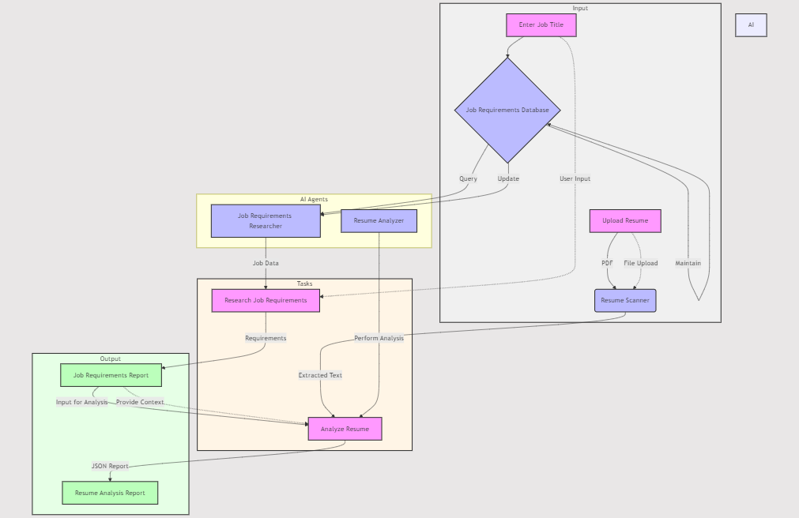

# Let's Automate Candidate Screening for the Company's HR Department

AI-Powered Candidate Screening: The Future of HR is Here (And It's Awesome!), Every Detailed Spell Out

## Introduction

Full Article : [https://medium.com/@learn-simplified/lets-manage-it-infrastructure-incidents-using-ai-agents-78c7e414e807

## TL;DR:

Imagine this: It's 9 AM on a Monday, and you're staring at a mountain of resumes on your desk. Your boss wants the perfect candidate for that critical new position, and they want them yesterday. You sigh, reach for your third cup of coffee, and prepare for a week of paper cuts and eye strain. Sound familiar?
Now, picture this instead: You walk into the office, flip open your laptop, and find a neatly organized report detailing the top candidates for that same position. Each resume has been thoroughly analyzed, matched against the job requirements, and ranked based on fit. And the best part? This all happened while you were enjoying your weekend.
No, you haven't entered the Twilight Zone. Welcome to the world of AI-powered candidate screening!


## What's This Project About

Okay, I know what you're thinking. "Great, another article about AI taking over the world." But hear me out! This isn't about replacing HR professionals with an army of robots (though that would make for a pretty cool sci-fi movie). It's about giving you superpowers to do your job better, faster, and with less stress.
In this article, we're going to roll up our sleeves and dive into the nitty-gritty of building an AI system that can transform your hiring process. And don't worry if you think "AI" is just something from your favorite Netflix show. We'll break it down in simple terms, no computer science degree required!
Here's what we're going to cover:
 - How to build a smart system that can read resumes like a pro (without the eye strain)
 - Creating a digital brain that understands job requirements better than that guy in accounting who thinks he knows everything
 - Matching candidates to jobs with the precision of a matchmaking grandma (but way faster)
 - Generating reports that'll make you look like a hiring wizard

But why should you care? Well, let me ask you this: Have you ever…
 - Spent hours sifting through resumes, only to realize you forgot what you were looking for in the first place?
 - Missed out on a great candidate because their resume got lost in the shuffle?
 - Wished you could clone yourself to handle all the hiring tasks on your plate?

If you answered "yes" to any of these, then buckle up, buttercup. We're about to change your world.

## Why Work on It?

Look, I get it. Your time is valuable. You've got meetings to attend, fires to put out, and maybe even a life outside of work (gasp!). So why should you spend the next few minutes reading this article? Let me give you three good reasons:
 - Time is Money (and Sanity): Imagine cutting your resume screening time from days to hours. What would you do with all that extra time? Learn to juggle? Finally organize your desk drawer? Or maybe, just maybe, focus on the parts of your job you actually enjoy?
 - Fairness is the New Black: We all have biases, whether we like to admit it or not. Maybe you have a soft spot for candidates who love dogs, or you're subconsciously favoring people who went to your alma mater. AI doesn't care if a candidate's hobbies include long walks on the beach or competitive hot dog eating. It just looks at the facts, ma'am.
 - Consistency is Key: Let's face it, by the time you get to the 50th resume of the day, your brain is probably thinking more about what's for dinner than the candidate's qualifications. AI doesn't get hangry. It'll give the last resume the same thorough treatment as the first.

Through our journey, you'll see how even small companies can use AI to punch above their weight class in the talent acquisition game. We're not just talking theory here - we're giving you a roadmap to implementation that'll make you the office hero.
So, are you ready to take your first step into the future of HR? Trust me, it's a lot cooler than flying cars (and way more practical). Let's dive in!


## Architecture



## Coding approach in brief

We'll start by creating a simple JSON file to store our job requirements. Create a file named `job_requirements_db.json`:

```json
{
  "software_developer": {
    "technical_skills": ["Python", "JavaScript", "React", "Node.js", "SQL"],
    "soft_skills": ["Communication", "Problem-solving", "Teamwork"],
    "experience": "3-5 years",
    "education": "Bachelor's in Computer Science or related field"
  },
  "data_analyst": {
    "technical_skills": ["Python", "R", "SQL", "Tableau", "Statistical Analysis"],
    "soft_skills": ["Data Visualization", "Critical Thinking", "Attention to Detail"],
    "experience": "2-4 years",
    "education": "Bachelor's in Statistics, Mathematics, or related field"
  }
}
```

## Step 3: Implementing the Resume Scanner

Create a file named `utils.py` and add the following code:

```python
import fitz

def scan_resumes(pdf_path):
    text = ''
    with fitz.open(pdf_path) as pdf_document:
        for page_num in range(pdf_document.page_count):
            page = pdf_document.load_page(page_num)
            text += page.get_text()
    return text
```

This function uses PyMuPDF to extract text from PDF resumes.

## Step 4: Setting Up AI Agents

Create a file named `agents.py`:

```python
from crewai import Agent
from langchain.tools import Tool

def agents(llm):
    job_requirements_researcher = Agent(
        role="Job Requirements Research Analyst",
        goal="Provide up-to-date analysis of industry job requirements",
        backstory="An expert analyst with deep knowledge of various job roles and their requirements.",
        tools=[Tool(
            name="Job Requirements Search",
            func=search_job_requirements,
            description="Searches the job requirements database for information about a specific job title."
        )],
        verbose=True,
        llm=llm
    )

    resume_analyser = Agent(
        role="Resume Analyser",
        goal="Perform a SWOT Analysis on the Resume based on the industry Job Requirements",
        backstory="An expert in hiring with a great understanding of resumes and job market trends",
        verbose=True,
        llm=llm
    )

    return job_requirements_researcher, resume_analyser

def search_job_requirements(job_title):
    # Implement this function to search your job requirements database
    pass
```

## Step 5: Defining Tasks

Create a file named `tasks.py`:

```python
from crewai import Task
from agents import agents

def tasks(llm, job_desire, resume_content):
    job_requirements_researcher, resume_analyser = agents(llm)

    research = Task(
        description=f"Research job requirements for {job_desire}",
        agent=job_requirements_researcher
    )

    resume_analysis = Task(
        description=f"Analyze resume for {job_desire} position",
        agent=resume_analyser
    )

    return research, resume_analysis
```

## Step 6: Building the Main Application

Create a file named `app.py`:

```python
import streamlit as st
from crewai import Crew, Process
from langchain_groq import ChatGroq
from utils import scan_resumes
from tasks import tasks

def main():
    st.title("AI-Powered Candidate Screening")

    job_desire = st.text_input("Enter Job Title:")
    resume_file = st.file_uploader("Upload Resume (PDF)", type="pdf")

    if job_desire and resume_file:
        with st.spinner("Analyzing resume..."):
            resume_content = scan_resumes(resume_file)
            
            llm = ChatGroq(groq_api_key="your_api_key_here")
            
            research, resume_analysis = tasks(llm, job_desire, resume_content)
            
            crew = Crew(
                agents=[research.agent, resume_analysis.agent],
                tasks=[research, resume_analysis],
                verbose=1,
                process=Process.sequential
            )

            result = crew.kickoff()

            st.subheader("Analysis Results")
            st.json(result)

if __name__ == "__main__":
    main()
```


# Tutorial: Automate Candidate Screening for the Company's HR Department 

## Prerequisites
- Python installed on your system.
- A basic understanding of virtual environments and command-line tools.

## Steps

1. **Virtual Environment Setup:**
   - Create a dedicated virtual environment for our project:
   
     ```bash
     python -m venv Lets-Automate-Candidate-Screening-for-the-Companys-HR-Department
     ```
   - Activate the environment:
   
     - Windows:
       ```bash
       Lets-Automate-Candidate-Screening-for-the-Companys-HR-Department\Scripts\activate
       ```
     - Unix/macOS:
       ```bash
       source Lets-Automate-Candidate-Screening-for-the-Companys-HR-Department/bin/activate
       ```
   
# Installation and Setup Guide

**Install Project Dependencies:**

Follow these steps to set up and run the 'Hands-On Guide: Automate Candidate Screening for the Company's HR Department' project:

1. Navigate to your project directory:
   ```
   cd path/to/your/project
   ```
   This ensures you're in the correct location for the subsequent steps.

2. Install the required dependencies:
   ```
   pip install -r requirements.txt
   ```
   This command installs all the necessary Python packages listed in the requirements.txt file.


## Run - Hands-On Guide: Automate Candidate Screening for the Company's HR Department

   ```bash 
     
      # Run 
      streamlit run app.py
      
   ```

## Conclusion and Next Steps

Congratulations! You've just built an AI-powered candidate screening system. This is just the beginning - you can extend this system by:

1. Implementing more sophisticated resume parsing
2. Adding more AI agents for different aspects of the hiring process
3. Integrating with your existing HR software

Remember, while AI can greatly assist in the hiring process, it should complement, not replace, human judgment. Use this tool to streamline your workflow and make more informed decisions.

Happy hiring, and may the best candidates rise to the top!